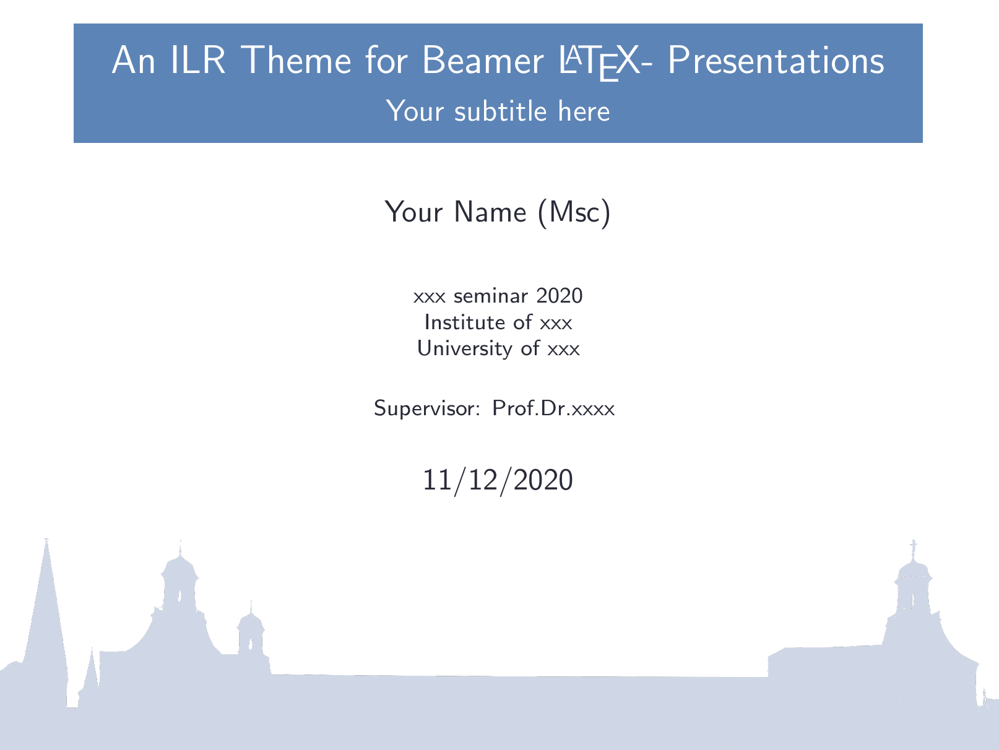
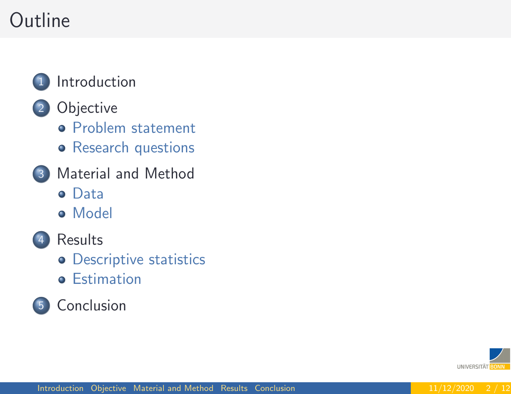

# ILR theme for [Beamer](https://ctan.org/pkg/beamer?lang=en)

> An ILR theme for [Beamer](https://ctan.org/pkg/beamer?lang=en).


|   |    |
|-----------------|-----------------|


## Install
#### Install using Git

If you are a git user, you can install the theme and keep up to date by cloning the repo:

    $ git clone https://github.com/bsrthyle/ilr-beamer.git

#### Install manually

Download using the [GitHub .zip download](https://github.com/bsrthyle/ilr-beamer/archive/master.zip) option and unzip them.

#### Activating theme


1. Add the `beamercolorthemeilr.sty` file to your projects root directory 
2. Add `\usecolortheme{ilr}` to your preamble
3. If you are using beamer with R Markdown , add `colortheme: "ilr"` to YAML header
   
```yaml

---
title: "An ILR Theme for Beamer Presentation"
subtitle: "Using R Markdown"
author: |
   | Your Name (Msc) 
   | example@gmail.com
institute: "Your instiution Name"
date: "1/16/2021"
output: 
  beamer_presentation:
    theme: "default"
    colortheme: "ilr"
    slide_level: 3
    incremental: true
---
```

## Team

This theme is maintained by the following person

[](https://github.com/bsrthyle) |
--- |
[Bisrat Haile](https://github.com/bsrthyle) |

## License

[MIT License](./LICENSE)